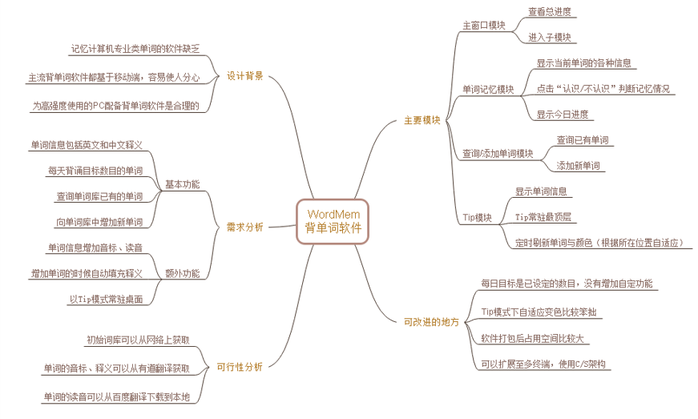
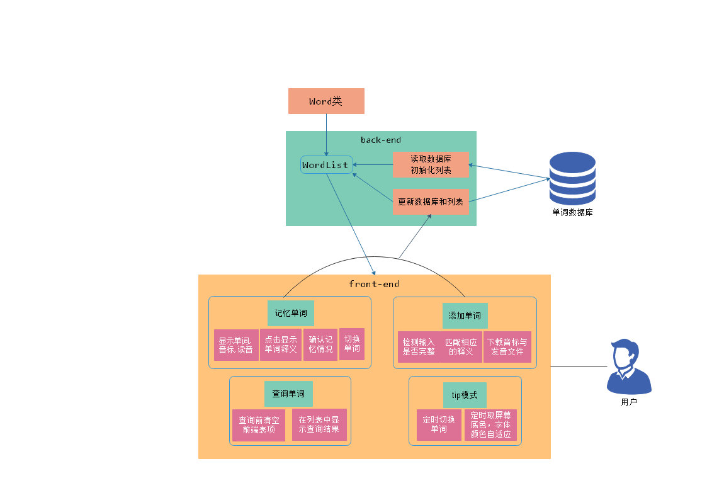
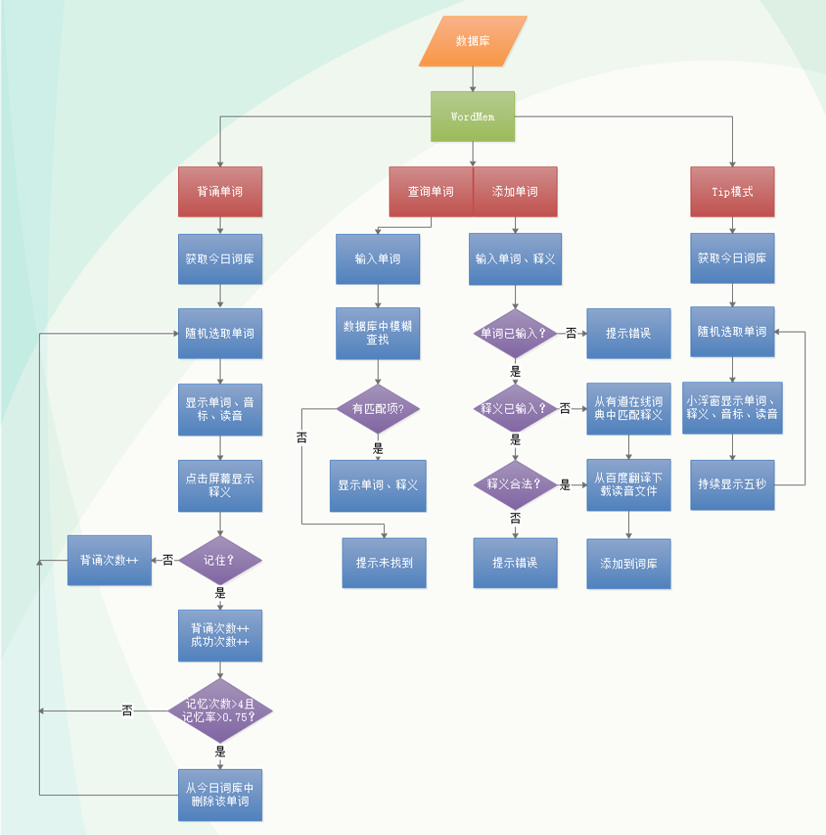

# WordMem 单词记忆软件设计文档

<font color=grey size=3 >_517021910555 邓鑫瑞_</font>

---

## 1. 引言

### 1.1 编写目的

&emsp;&emsp;记录软件设计与实现流程，阐述软件的组织架构，方便他人快速了解此软件。
&emsp;&emsp;本文档供授课老师、助教、设计人员与开发人员参考。

### 1.2 项目说明

- 项目名称：WordMem 单词记忆软件
- 任务来源：上海交通大学应用软件课程设计小作业
- 项目作者：邓鑫瑞

## 2. 系统概述与分析

&emsp;&emsp;软件整体的思维导图如下所示，


### 2.1 设计背景

- 在学习过程中，英文文献里的专业词汇难以记忆，影响阅读和学习效率。
- 主流的单词记忆软件基本都是应试型的，只针对特定考试，不能添加专业单词，缺乏针对计算机专业词汇的记忆软件。
- 主流的单词记忆软件大多基于移动端（以智能手机为主），方便快捷但并不可靠，消息提醒的弹窗很容易令人分心，大大影响学习效率。
- 作为计算机类专业的学生，我们对 PC 的使用时间长，工作效率高，这同时也削弱了移动端方便的特点，因此为 PC 配备一款背单词的软件是很有必要的。

### 2.2 需求分析

#### 2.2.1 功能需求

- **记忆单词：** 显示单词的释义、音标与读音，选择单词的记忆情况并跳转单词。
- **查询单词：** 查询单词库中的已有单词；对词库中没有的单词，能够到网络上查询。
- **添加单词：** 向单词库中添加新的单词，并自动到网络上获取音标与发音。
- **Tip 模式：** 以 Tip 浮窗形式常驻于桌面，并能定时更新显示的单词。

#### 2.2.2 运行需求

- **环境需求：** WordMem 的运行方式分为两种：exe 可执行文件运行方式、py 源代码文件运行方式。两种方式都需要文件夹中包含初始单词数据库的 db 文件、包含发音文件的文件夹和包含软件界面图片的文件夹。第一种方式还需要 WordMem 软件打包好的 exe 可执行文件、直接在文件夹中点击运行 exe 文件即可。第二种方式还需要安装 python 环境与包依赖，其版本号如下表所示，使用 conda 或 pip 安装完成后，在终端中切换至文件夹路径执行 python frontend.py 即可运行。

  | 包名称   | 版本号 |
  | -------- | ------ |
  | Python   | 3.7.3  |
  | PyQt5    | 5.10   |
  | Numpy    | 1.18.1 |
  | Sqlite   | 3.27.2 |
  | wget     | 3.2    |
  | requests | 2.23.0 |
  | pygame   | 1.9.6  |

- **网络需求：** 单词的添加需要到网络上获取释义、音标、发音文件，因此需要网络连接支持。

#### 2.2.3 其他需求

- **可扩展性：** 后续会进一步对 WordMem 软件进行更新与升级，在软件开发过程中需要注意软件的可扩展性。
- **软件性能：** 软件需要与用户进行交互和访问互联网，因此对其响应时间、错误处理、功能恢复等性能有较高要求。
- **扩展至多终端：** 如果开发时间充裕，可以将 WordMem 扩展至 Android、iOS、iPadOS 等移动终端操作系统上去，并采用服务器/客户端架构，让用户以账号密码方式登录，以便用户能够在多终端上进行学习。

### 2.3 可行性分析

- **技术可行性：** Python 的 Sqlite3 依赖包可以对数据库进行管理；Pyqt5 可以设计用户界面；其他依赖包也可以覆盖本软件的需求，因此可以完全使用 Python 进行软件开发在技术上是绝对可行的。
- **经济可行性：** 本软件使用的依赖都是可以使用 conda 或 pip 免费安装的；需要从网络上获取的音标和发音文件也都是公开的，不需要支付任何费用，因此在经济上是可行的。
- **法律可行性：** 本软件的设计、开发及运行过程中不存在任何侵权问题，且未对任何个人、组织、事物造成侵害，因此在法律上时可行的。

## 3.总体架构与设计

### 3.1 总体结构图

&emsp;&emsp;系统总体的结构图如下所示，


### 3.2 流程图

&emsp;&emsp;系统主要分为四个模块：单词背诵模块、查询单词模块、添加单词模块、Tip 模块。其中查询和添加单词集成在同一界面中。主要流程如下所示，


### 3.3 模块功能介绍

#### 3.3.1 单词背诵模块

&emsp;&emsp;当前背诵的单词是由后端从今日词库中随机选择，以 w.thisword 将一个 Word 类型的变量传给前端界面显示的。前端显示单词、音标、发音按钮和释义按钮，用户可以点击发音按钮播放发音，点击释义按钮查看释义，点击认识/不认识按钮确认记忆情况，此时会判断是否达到已经记忆的标准，并自动更新单词记忆状态、切换到下一个单词。
&emsp;&emsp;其中点击认识/不认识按钮调用的处理模块如下所示，

```py
def nextword(self):
    try:
        self.thisword = np.random.choice(self.todayunknownList, size=1, replace=False, p=None)[0]
    except ValueError:
        return True
    else:
        return False

def IRemember(self):
    self.thisword.testedCount += 1
    self.thisword.correctCount += 1
    for index, i in enumerate(self.todayunknownList):
        if i.enWord == self.thisword.enWord:
            self.todayunknownList[index] = self.thisword
            # print(self.todayunknownList[index].testedCount)
    if self.thisword.testedCount >= 4 and self.thisword.correctCount/self.thisword.testedCount >= 0.75:
        if self.thisword in self.todayunknownList:
            self.todayunknownList.remove(self.thisword)
        if self.thisword not in self.todayrememberList:
            self.todayrememberList.append(self.thisword)
        self.update_db(word=self.thisword, mode='update')
    return self.nextword()

def IDonotRemember(self):
    self.thisword.testedCount +=1
    for index, i in enumerate(self.todayunknownList):
        if i.enWord == self.thisword.enWord:
            self.todayunknownList[index] = self.thisword
    return self.nextword()
```

#### 3.3.2 单词查询与添加模块

&emsp;&emsp;这两个模块集成在了同一个窗口中，并且采用**输出重定向技术**向用户提示消息。
&emsp;&emsp;**单词查询模块**采用模糊查询的方法，在数据库查询相似的单词，将结果展示给用户，如果没有匹配的单词则不会显示。无论查询成功与否，都会向用户输出消息。其中模糊匹配的模块如下所示：

```py
def fuzzsearch(self, en_word):
    try:
        db = sqlite3.connect(self.dbname)
    except AttributeError:
        db = sqlite3.connect(os.path.join(sys.path[0], 'wordlist.db'))
    cursor = db.cursor()
    sql = """select ENGLISH, CHINESE from wordlist where ENGLISH like '%"""+en_word+"""%' --case-insensitive"""
    q = cursor.execute(sql)
    query = q.fetchall()
    if len(query):
        return query
    else:
        return []
```

&emsp;&emsp;**单词添加模块**会先检查输入是否完整，如果没有输入单词，会提示错误；如果只输入了单词，会从有道网络词典中获取释义填充到释义中，用户可以通过再次点击添加完成操作；如果单词和释义都完整输入，则会先判断单词是否存在，如果存在会向用户提示信息，否则将会将单词信息添加到单词数据库，从百度翻译中下载读音文件到本地，完成操作。其中获取释义、发音文件的模块如下所示：

```py
def proun_download(self, enword):       # 下载发音文件
    img_url = 'https://fanyi.baidu.com/gettts?lan=uk&text='+enword+'&spd=3&source=web'
    wget.download(img_url ,"pronunciation\\"+enword+".mp3")

def get_from_youdao(self, en='', cn='', mode='p'):  # 从有道翻译获取释义/音标
    en = en.replace(" ","_")
    phoneticSpelling = ""
    request = requests.get("http://dict.youdao.com/w/"+en)
    html = request.text
    if mode=='p':   # 获取音标
        regularExpression = r'<span\s+class="phonetic">(.*)</span>'
        matchObject = re.search(regularExpression,html,re.I)
        if matchObject:
            if matchObject.group(1):
                phoneticSpelling = matchObject.group(1)
                return phoneticSpelling.replace('\'','\'\'')
    elif mode=='c': # 获取释义
        translation = ''
        regularExpression = r"<li>([a-z].*)</li>"
        matchObject = re.findall(regularExpression,html,re.I)
        for i in matchObject:
            translation += i + ' '
        return translation.replace(' ', '')
```

#### 3.3.3 Tip 模式模块

&emsp;&emsp;Tip 模式在屏幕右侧的小型透明浮窗上显示当前单词、释义、音标和发音按钮，定时更新当前单词，定时在浮窗中央取色，将字体设置为其反色，使字体尽可能更明显。

## 4. 接口设计

### 4.1 用户接口

&emsp;&emsp;本软件对用户友好，用户接口依靠点击按钮和输入来触发响应的事件，执行相应的操作。

- 单词背诵模块：允许用户点击发音按钮播放发音，允许用户点击释义按钮显示释义。
- 单词查询模块：允许用户输入要查询的单词。
- 单词添加模块：允许用户输入单词、释义，以向数据库添加单词。
- Tip 模式模块：允许用户点击发音按钮播放发音。

### 4.2 内部接口

&emsp;&emsp;本项目中的内部接口均写在 Wordlist.py 中，以供前端调用，主要包含以下接口：

- 记忆情况处理：IRemember()、IDonotRemember()
- 更新数据库（分为 add 和 update 两种模式）：update_db(word=None, en_word='', cn_word='', mode='')
- 模糊搜索单词：fuzzsearch(en_word)
- 下载发音文件：proun_download(enword)
- 播放发音文件：pronunciation()
- 从有道词典获取信息（分为 p 和 c 两种模式）：get_from_youdao(en='', cn='', mode='p')

## 5. 软件未来展望

### 5.1 展望概述

&emsp;&emsp;由于开发时间有限，WordMem 软件仍存在一些不足和待改进之处，有一些之前计划内的功能没来得及完善就仓促成型，因此需要后期修复处理；并且近期投入使用后，我们又从用户角度发现了一些可优化之处。结合这两点，我将继续推进原有功能的完善和全新功能的开发，优化用户的体验。

### 5.2 软件改进方向

- WordMem 软件中用户每日背诵目标是预先设定的数目（50 个/天），并未留有用户接口，用户不能自己设定数目。
- 在 Tip 模式下，虽然设定了字体自适应变色，但是取色的方式是仅取浮窗中央一点，实际上背景往往不是纯色，这种取色方式略显笨拙，可以使用更智能的取色和自适应方法。
- 此软件的 py 源码打包成 exe 可执行文件后的空间占用比较大。
- 此软件现在仅限于电脑端使用，没有在其他终端上实现。
- 此软件中需要从网络上下载发音文件，其占用的空间基本在 20-30k，对小容量硬盘用户不友好，可以考虑下载后对发音文件进行压缩以节省空间。
